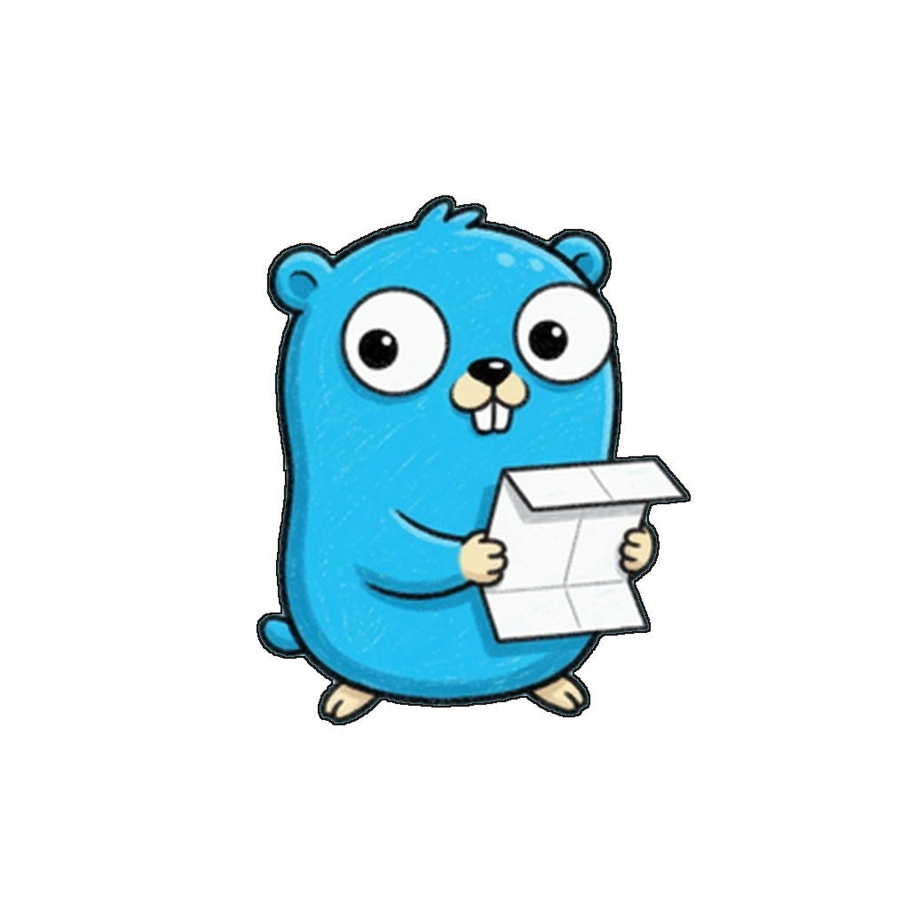

<h1 align="center">
  <br>
  gowkhtmltopdf
</h1>

gowkhtmltopdf is a no-cgo **PDF engine based on HTML templates** (and HTML→image)
for **structured templates and documents**: invoices, receipts, certificates,
storybooks, posters, statements, tables, and multi-page documents with headers,
footers, tables of contents, and PDF outlines — without any wrappers.

It is a clean-room work-alike of the [wkhtmltopdf](https://wkhtmltopdf.org/)
CLI surface. There is **no browser**, **no cgo**, and no native converter
process. Two static binaries (`gowkhtmltopdf`, `gowkhtmltoimage`) and a Go
library run an in-repo pipeline (load → parse → style → layout → paginate →
paint → write). Direct modules are allowlisted:
[`go-text/typesetting`](https://github.com/go-text/typesetting) (OpenType
shaping) and [`tdewolff/canvas`](https://github.com/tdewolff/canvas) (SVG
rasterization). The product is HTML templates and documents, not Chrome visual parity.

**Status:** **v0.2.4** (current release). The native Document API and explicit
CLI grammar are now the supported surface. Opt-in PDF 1.7 / 2.0 and PDF/A +
PDF/UA profiles. **License:** [MIT](LICENSE).

> **Note on `master`:** `master` tracks active development and may be broken
> at times. For a stable build, use the [latest tagged release](https://github.com/chinmay-sawant/gowkhtmltopdf/releases).

## What it is for

| You need… | This project |
|-----------|----------------|
| Invoices, tables, page breaks from Go | Yes |
| Headers, footers, TOC, PDF bookmarks | Yes |
| PDF 1.4 / PDF 1.7 / PDF 2.0 output | Default PDF 1.4. Opt-in 1.7 / 2.0 via `--pdf-version`. Version alone is **not** a PDF/A or PDF/UA claim |
| PDF/A-3a & PDF/UA-1 compliance | Opt-in via `--pdf-profile a3a-ua1` / `WithPDFProfile` (implies PDF 1.7) |
| PDF/A-4 & PDF/UA-2 compliance | Opt-in via `--pdf-profile a4-ua2` / `WithPDFProfile` (implies PDF 2.0) |
| Offline static binaries; no browser / no cgo | Yes |
| Full CSS, JavaScript, or Chrome parity | No — print CSS subset; no JS |
| CJK / complex Unicode | Partial — Type0/CID + `--font-path`; see [fonts.md](documentation/fonts.md) |

## Quick start

Requires Go 1.26+.

```sh
make build
./bin/gowkhtmltopdf --allow-local-files -o /tmp/invoice.pdf \
  testdata/golden/fixture-01-simple-invoice.html
```

Committed samples live in [output/](output/) (`make samples`).
Install, flags, and HTTP URLs: [getting-started.md](documentation/getting-started.md).

## Documentation

| Document | What it covers |
|----------|----------------|
| [documentation/README.md](documentation/README.md) | Documentation index |
| [documentation/overview.md](documentation/overview.md) | Product overview and design principles |
| [documentation/getting-started.md](documentation/getting-started.md) | Install and first conversion |
| [documentation/cli.md](documentation/cli.md) | CLI grammar and flags |
| [documentation/library-api.md](documentation/library-api.md) | Go library API |
| [documentation/MIGRATION-0.2.4.md](documentation/MIGRATION-0.2.4.md) | 0.2.3 library/CLI to the 0.2.4 Document API |
| [documentation/architecture.md](documentation/architecture.md) | Package map and pipeline |
| [documentation/architecture/README.md](documentation/architecture/README.md) | Deep-dive architecture notes |
| [documentation/fidelity.md](documentation/fidelity.md) | Fidelity tiers and claims language |
| [documentation/compatibility-matrix.md](documentation/compatibility-matrix.md) | Per-element / per-property / per-flag contract |
| [documentation/fonts.md](documentation/fonts.md) | Bundled faces, `--font-path`, `@font-face` |
| [documentation/samples.md](documentation/samples.md) | Golden fixtures and `output/` |
| [documentation/performance.md](documentation/performance.md) | Benchmarks and how to measure |
| [testdata/golden/benchmarks/README.md](testdata/golden/benchmarks/README.md) | Current CLI vs wkhtmltopdf snapshot |
| [documentation/deferred.md](documentation/deferred.md) | Deferred features and next gates |
| [documentation/THREAT-MODEL.md](documentation/THREAT-MODEL.md) | Security / ACL / network policy |
| [documentation/integration-security.md](documentation/integration-security.md) | Embedding in HTTP apps (SSRF) |
| [comparison: go-wkhtmltopdf](documentation/comparison-with-others/sebastiaanklippert-go-wkhtmltopdf.md) | Binary wrapper vs this in-process engine |
| [comparison: 2026 landscape](documentation/comparison-with-others/landscape-2026.md) | Chromium, wkhtmltopdf, WeasyPrint, Prince |
| [CONTRIBUTING.md](CONTRIBUTING.md) | Setup, tests, PR workflow |
| [CHANGELOG.md](CHANGELOG.md) | Release history |
| [examples/](examples/) | Library example programs |
| [output/](output/) | Regenerable sample PDFs/PNG |
| [plans/README.md](plans/README.md) | Implementation ledger index |
| [LICENSE](LICENSE) | MIT license |

## Library

The supported Go API is `Document` / `ImageDocument` with explicit `Content`
sources. The pre-0.2.4 wkhtml-shaped root exports are removed.

```go
doc := gowkhtmltopdf.Document{
    Pages: []gowkhtmltopdf.Page{{
        Source: gowkhtmltopdf.Content{
            HTML: []byte(`<html><body><h1>Invoice</h1></body></html>`),
        },
    }},
    PageSize: "A4",
}
pdfBytes, err := doc.PDF(ctx)
```

Local files, TOC/cover fields, network policy, and the migration table:
[documentation/library-api.md](documentation/library-api.md),
[documentation/MIGRATION-0.2.4.md](documentation/MIGRATION-0.2.4.md).

## Performance

**Current snapshot (2026-08-19):** freshly built generic `gowkhtmltopdf`
**0.2.4** versus installed **wkhtmltopdf 0.12.6.1 (patched Qt)** on Linux
amd64, 13th Gen Intel Core i7-13700HX. Same report fixture (20 invoice rows
per requested page), median of three process runs after one warmup.

| Pages | gowkhtmltopdf | wkhtmltopdf | Faster by |
|------:|--------------:|------------:|----------:|
| 2 | 17 ms | 259 ms | **15.5x** |
| 10 | 30 ms | 276 ms | **9.2x** |
| 100 | 184 ms | 526 ms | **2.9x** |
| 500 | 1.042 s | 1.671 s | **1.6x** |

Faster at every tested size. Peak RSS is lower through 100 pages and
higher from 200 pages on the generic path.

Same host, same fixture family against other engines (default external
matrix: 2 / 10 / 50 / 100 pages):

| Pages | vs WeasyPrint | vs Puppeteer / Chrome |
|------:|--------------:|----------------------:|
| 2 | **32x** | **77x** |
| 10 | **44x** | **48x** |
| 50 | **52x** | **17x** |
| 100 | **57x** | **11x** |

Full matrices, RSS, PDF sizes, internal-engine and public-library
`go test -bench` rows, and historical snapshots:

- [documentation/performance.md](documentation/performance.md)
- [testdata/golden/benchmarks/README.md](testdata/golden/benchmarks/README.md)
- [cli-compare.md](testdata/golden/benchmarks/cli-compare.md)
- [weasyprint-compare.md](testdata/golden/benchmarks/weasyprint-compare.md)
- [puppeteer-compare.md](testdata/golden/benchmarks/puppeteer-compare.md)

Reproduce:

```sh
make bench-cli-compare
make bench
make bench-engine
make bench-lib
```

## Development

gowkhtmltopdf was designed and built as a clean-room pure-Go engine, pairing human architecture and domain design with modern AI-assisted engineering tools (including Grok, OpenAI Codex, OpenCode, and Cursor) for accelerated implementation, golden fixture visual verification, and comprehensive test suites.

## License

[MIT License](LICENSE) — Copyright (c) 2026 **Chinmay Sawant**.

Bundled Liberation and DejaVu fonts are SIL OFL / Bitstream Vera; see
[internal/pdf/assets/NOTICE](internal/pdf/assets/NOTICE).
The Noto KR test subset ships [testdata/fonts/OFL.txt](testdata/fonts/OFL.txt).
