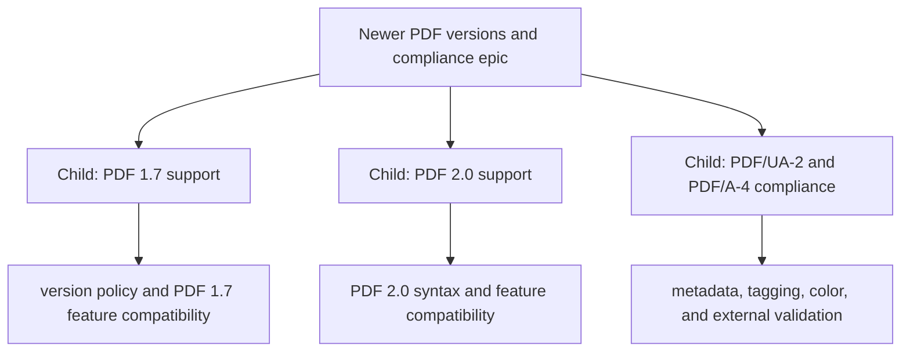

## Context

The current PDF writer is intentionally scoped to PDF 1.4. The repository documents PDF 1.4 output in `README.md`, `documentation/overview.md`, `documentation/architecture.md`, and the `internal/pdf` package. PDF 1.7 compatibility, PDF 2.0 output, and standards-oriented compliance are not currently implemented as a product contract.

This epic creates a separate future workstream for newer PDF versions and compliance. It should not be mixed into the HTML/CSS layout issue. Layout correctness, PDF serialization version, and standards compliance have different evidence, compatibility, and validation requirements.

The epic should first establish the supported baseline, then split implementation into independently verifiable child issues. The layout-engine issue is intentionally separate because renderer fidelity and PDF format support have different validation boundaries.

## Child issues

- [ ] [#31](https://github.com/chinmay-sawant/gowkhtmltopdf/issues/31) - pdf: PDF 1.7 support
- [ ] [#32](https://github.com/chinmay-sawant/gowkhtmltopdf/issues/32) - pdf: PDF 2.0 support
- [ ] [#33](https://github.com/chinmay-sawant/gowkhtmltopdf/issues/33) - pdf: PDF/UA-2 and PDF/A-4 compliance support

## Scope (in)

1. Record the current PDF 1.4 writer behavior and the exact currently supported feature set.
2. Define the compatibility policy for reading, emitting, and validating PDF 1.7 and PDF 2.0 documents.
3. Identify which PDF 1.7 features are useful for this project, such as newer object syntax, transparency and color requirements, metadata, tagged structure, embedded files, or archival profiles.
4. Create a standards matrix for PDF/A profiles, PDF/UA, encryption, forms, ICC output intent, metadata, accessibility tagging, and signatures.
5. Preserve the pure-Go, deterministic, no-CGO policy unless a separately approved architecture amendment is required.
6. Add child issues with narrow implementation and validation gates rather than one unbounded compliance project.

## Out of scope

- Claiming PDF 1.7 or PDF 2.0 support solely by changing the `%PDF-1.4` header.
- Claiming PDF/A, PDF/UA, encryption, signatures, or AcroForm compliance without conformance validation.
- Replacing the HTML/CSS layout engine with a browser.
- Changing the current PDF output version before the compatibility and validation plan is approved.
- Implementing every PDF 2.0 feature in one batch.

## Success criteria

- [ ] Current PDF 1.4 output and feature boundary are documented accurately.
- [ ] A version policy distinguishes file-header version, object syntax, feature compatibility, and conformance claims.
- [ ] PDF 1.7 and PDF 2.0 support are split into implementation-sized child issues.
- [ ] PDF/A, PDF/UA, encryption, forms, signatures, ICC, metadata, and accessibility requirements have explicit owners and validation tools.
- [ ] Versioned golden PDFs and structural validators are defined before changing the writer.
- [ ] Existing PDF 1.4 golden tests remain green until a deliberate compatibility transition is approved.
- [ ] Documentation and compatibility matrices are updated with honest support claims.

## Plan

1. Audit the current `internal/pdf` writer, tests, output headers, catalog, pages tree, fonts, images, annotations, outlines, and metadata.
2. Create a PDF feature/version matrix with three separate states: emitted, accepted, and validated.
3. Decide whether the first deliverable should be PDF 1.7-compatible serialization, PDF 2.0 output, or standards profiles built on the existing writer.
4. Define version-aware writer interfaces and avoid scattering version checks across content, font, image, and catalog code.
5. Add structural and external conformance validation for every claimed profile.
6. Migrate documentation only after the generated files and validators prove the claim.

### Suggested code ownership

| Concern | Primary code | Expected change |
|---|---|---|
| Version policy | `internal/pdf/pdf.go`, new version policy type | Centralize PDF version and feature gates |
| Header and document catalog | `internal/pdf/pdf.go` | Emit version and catalog entries from one policy |
| Objects and xref | `internal/pdf/content.go`, writer files | Add only syntax required by an approved version |
| Fonts and Unicode | `internal/pdf/fonts.go`, `fonttype0.go` | Verify versioned font requirements and Unicode maps |
| Images and transparency | `internal/pdf/images.go` | Validate color space, alpha, filters, and version gates |
| Metadata and output intent | new focused package or `internal/pdf` module | Add XMP, ICC, and profile-specific metadata without global state |
| Forms and signatures | future child issues | Keep out of baseline until data model and validation are approved |
| Validation | `internal/pdf/*_test.go`, external validator fixtures | Test structure plus profile conformance |
| Documentation | `README.md`, `documentation/architecture.md`, `documentation/compatibility-matrix.md` | Publish only verified claims |

## References

- Current PDF pipeline: `internal/pdf/pdf.go`
- Current writer description: `documentation/architecture.md:18`
- Current output claim: `README.md:50-54`
- Existing PDF feature gap: `plans/exploration/02-pdf-converter.md:24`
- Current compliance boundary: `documentation/compatibility-matrix.md:255`
- Related layout child issue: `plans/PR/issues/issue-original-template-rendering-body.md`
