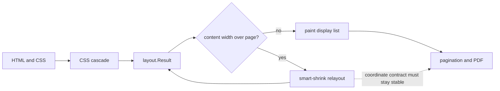

## Context

Chrome renders the original stationery and ticket templates correctly, but the current Gowkhtmltopdf pipeline needs renderer-specific HTML/CSS workarounds to produce acceptable PDFs. That is the wrong long-term contract: the templates are valid print HTML, and the engine should resolve their layout consistently instead of requiring authors to replace floats, borders, absolute images, or footer flow with implementation-specific markup.

The recent fixture 50 and fixture 52 work exposed a common engine problem rather than two independent template bugs:

- `fixture-50-letter-template.html` uses a local image, an inline quote treatment, CSS colors, and normal document flow. Border paint and inline image alignment were not stable enough for the original markup.
- `fixture-52-airline-boarding-pass.html` (formerly night-train tickets) is a multi-column boarding-pass sheet; earlier illustrated ticket layouts used a bordered flex row with a fixed-size image at the right edge, where `position: absolute; right: 0` could escape the visible ticket border during smart-shrink layout.
- Replacing the markup with tables, wrapper frames, or in-flow image rows changes the source document instead of improving the renderer and can introduce blank pages or new sizing differences.

**Parent epic:** [#29](https://github.com/chinmay-sawant/gowkhtmltopdf/issues/29) - newer PDF versions and compliance.

This issue is also a focused follow-up to the closed rendering-quality epic #2. It does not reopen the broad goal of Chrome parity. It targets the controlled, static print templates that the project already treats as golden fixtures.

### Current pipeline seam



The risk is that width measurement, zoom, containing-block resolution, replaced-image sizing, paint coordinates, and pagination are not treated as one explicit geometry contract.

### Evidence in the current code

Smart shrinking performs a second layout pass with a new zoom value:

```go
// internal/convert/convert.go:508-532
if contentW2 := measuredWidth(lres); contentW2 > contentW+smartShrinkMinOverflow {
    zoom := contentW / contentW2
    objectRender.zoom = zoom
    lres, err = layout.LayoutContext(ctx, root, state.bodyLayoutOpts(objectRender))
}
```

Replaced-image sizing is centralized, but containing-width and final paint geometry still need to be verified for positioned and flex children:

```go
// internal/layout/layout_images.go:39-83, 196-220
size = applyImageCSSRatio(size, cssW, cssH, ref)
size = clampImageWidth(size, e.imageMaxWidth(style, cssW))
size = clampImageHeight(e, size, style)
```

Flex rows currently measure and place children through a report-oriented subset:

```go
// internal/layout/flex.go:54-110
boxNode.w = resolveUsedWidth(sty, availW, e)
...
curY = e.flowFlexRow(boxNode, kids, sty, contentW, contentX, posY, curY, colGap, rowGap)
boxNode.height = curY
```

Inline replaced elements use their own vertical-alignment calculation:

```go
// internal/layout/inline_paint.go:61-99
switch item.style.VerticalAlign {
case cssVerticalAlignTop:
    top = lineY
case cssVerticalAlignMiddle:
    top = lineY + (lineH-item.h)/two
}
```

These paths need shared geometry tests so that the same used rectangle is used for layout, clipping, paint, and pagination.

## Scope (in)

1. Define and document a single coordinate contract for layout, smart-shrink relayout, positioned containing blocks, replaced elements, borders, and pagination.
2. Audit absolute and relative positioning so `top`, `right`, `bottom`, `left`, width, height, borders, and overflow clipping resolve against the correct final containing block after zoom.
3. Audit replaced-element sizing and painting for PNG, JPEG, and SVG-backed images, including intrinsic ratio, explicit dimensions, `object-fit`, and border-box clipping.
4. Improve flex row measurement for fixed-height children, replaced elements, padding, borders, and `min-width: 0` behavior without creating phantom overflow or blank pages.
5. Make inline image vertical alignment use the same line box metrics as text and borders, including `vertical-align: top`, `middle`, and baseline behavior.
6. Verify deferred chrome and border operations use the final box rectangle and do not create duplicate or stale border segments.
7. Preserve the existing pagination contracts in `layout.Result`, including `flowPages`, `flowPageOf`, `flowPos`, and page ownership while applying geometry fixes.
8. Add visual and structural regression coverage using the original, unmodified forms of fixtures 50 and 52. The tests must fail on the current renderer symptoms and pass without fixture-specific workaround markup.
9. Update `documentation/fidelity.md` and `documentation/compatibility-matrix.md` with the supported controlled-template behavior and the remaining non-browser limitations.

## Out of scope

- Full Chrome, Blink, or WebKit parity.
- JavaScript execution, DOM mutation, SPA hydration, or browser APIs.
- Rewriting the golden fixtures to hide renderer defects.
- Adding a browser process or abandoning the pure-Go and no-CGO runtime policy.
- Full CSS Grid Level 3, subgrid, masonry, or complex stacking-context parity.
- Pixel-identical rendering across every browser and PDF viewer.

## Success criteria

- [ ] The original fixture 50 HTML renders as a one-page PDF with the quote text, quote accent, header rule, image, and signature aligned without workaround markup.
- [ ] The original fixture 52 HTML renders as a one-page PDF with all four right-side logos fully inside their ticket borders and no extra page.
- [ ] Absolute positioned images with `right: 0` remain inside a bordered containing block after smart shrinking.
- [ ] Fixed-height flex rows with replaced children do not create phantom overflow, blank pages, or border/image disagreement.
- [ ] Inline image alignment has regression assertions for top, middle, and baseline placement.
- [ ] Border/background paint and pagination use the same final box rectangle and do not duplicate stale segments.
- [ ] `go test ./internal/layout/... ./internal/convert/...` passes, including the new regression tests.
- [ ] `TestGoldenCorpusAllFixtures` continues to enforce the existing page envelopes and embedded-image expectations.
- [ ] Documentation states what is supported for controlled print templates and what remains intentionally below browser fidelity.

### Fixture 55 rendering follow-up

- [x] Capture the regenerated PDF pages and compare the first-page masthead,
  second-page status pills, and footer geometry against the source CSS.
- [x] Resolve the fixture's Arial, Georgia, and Courier New declarations to
  deterministic bundled Liberation Sans, Serif, and Mono faces with matching
  regular/bold/italic selection.
- [x] Carry `border-radius` through resolved styles and display-list paint so
  circles, pills, and rounded status borders are rendered as curved paths.
- [x] Position the absolute `.page-footer` against the final containing-block
  bottom instead of the containing-block top.
- [x] Preserve nested flex max-content widths, flex gaps, and letter-spacing so
  the first-page masthead brand and right metadata keep their intended lines
  and right alignment.
- [ ] Add a fixed-resolution HTML-versus-PDF visual-diff gate for fixture 55.

## Plan

1. Capture the current failures as minimal layout tests before changing implementation code.
2. Add geometry-level observability in tests: used box rect, containing block rect, image rect, border rect, page index, and applied zoom.
3. Introduce one shared final-geometry path for positioned boxes and replaced elements. Do not calculate one rectangle for layout and another for paint.
4. Make smart-shrink relayout recompute all dependent geometry from the final zoom and expose the final zoom to paint and pagination consistently.
5. Fix flex and inline replaced-element measurement and alignment, then add targeted tests for fixed heights, borders, overflow, and intrinsic aspect ratios.
6. Re-run the original fixtures and compare screenshots at a fixed resolution. Keep fixture HTML unchanged while validating the engine fix.
7. Run the full golden corpus and update compatibility documentation only after the visual and structural gates pass.

### Suggested code ownership

| Concern | Primary code | Expected change |
|---|---|---|
| Smart-shrink contract | `internal/convert/convert.go` | Carry final zoom and geometry assumptions through relayout and paint |
| Layout options and used rectangles | `internal/layout/layout.go`, `internal/layout/container.go` | Make containing-block and final box coordinates explicit |
| Positioned layout | `internal/layout/layout_flow.go`, `internal/layout/transform.go` | Resolve offsets after final containing-block dimensions and zoom |
| Replaced images | `internal/layout/layout_images.go` | Unify intrinsic sizing, CSS sizing, clipping, and used image rect |
| Flex measurement | `internal/layout/flex.go` | Account for fixed dimensions, borders, padding, and min-size behavior |
| Inline image alignment | `internal/layout/inline.go`, `internal/layout/inline_paint.go` | Share line-box metrics with text and image paint |
| Backgrounds and borders | `internal/layout/layout_chrome.go` | Paint final border-box rectangles exactly once |
| Pagination | `internal/layout/paint_pagination.go` | Preserve flow indexes while moving or clipping final ops |
| Regression gates | `internal/layout/*_test.go`, `internal/convert/golden_test.go` | Add symptom-specific layout tests and original-template PDF checks |

## References

- Parent epic: [#29](https://github.com/chinmay-sawant/gowkhtmltopdf/issues/29)
- Parent context: closed epic [#2](https://github.com/chinmay-sawant/gowkhtmltopdf/issues/2)
- Original inputs: `testdata/golden/fixture-50-letter-template.html`, `testdata/golden/fixture-52-airline-boarding-pass.html`
- Current samples: `output/fixture-50-letter-template.pdf`, `output/fixture-52-airline-boarding-pass.pdf`
- Pipeline documentation: `README.md`, `documentation/fidelity.md`, `documentation/compatibility-matrix.md`
- Golden contract: `internal/convert/golden_test.go:394-402`
- Smart shrinking: `internal/convert/convert.go:508-532`
- Replaced images: `internal/layout/layout_images.go:39-83,196-220`
- Flex layout: `internal/layout/flex.go:54-110`
- Inline image paint: `internal/layout/inline_paint.go:61-99`
- Border and chrome paint: `internal/layout/layout_chrome.go:110-183`
- Pagination indexes: `internal/layout/layout.go:85-105`
