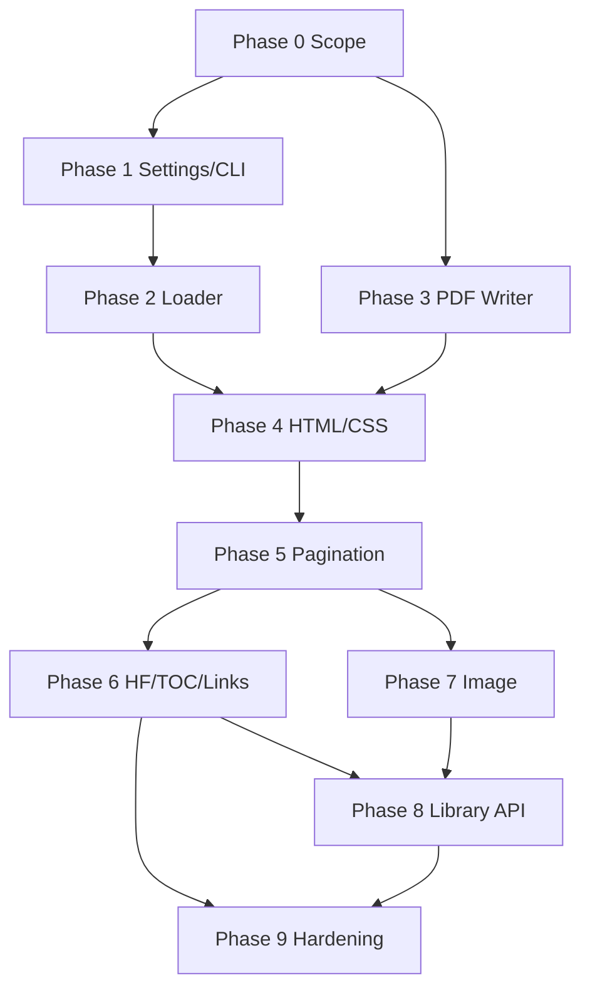

# 00 — Pure-Go wkhtmltopdf Rewrite (Canonical Execution Ledger)

> **Parent:** none — root plan  
> **Status:** Phases 0–8 complete (2026-08-03); Phase 9 remaining  
> **Estimated effort:** MVP 18–28 person-months · Intermediate 45–70 PM · Full parity not realistic (stdlib-only)  
> **Constraint:** pure Golang, **Go standard library only** (no third-party modules, no Chrome/WebKit, no cgo)  
> **Source analyzed:** `wkhtmltopdf/` (v0.12.7-dev) via 5 explore subagents  
> **Evidence:** `plans/exploration/*`, phase details in `plans/phases/*`

---

## Overview

This ledger tracks a complete rewrite of [wkhtmltopdf](wkhtmltopdf/) as a pure-Go project (**gowkhtmltopdf**). Upstream is a thin orchestration layer over **Qt WebKit + QPrinter**, not a self-contained HTML/PDF engine. A pure-stdlib rewrite therefore means building:

1. A **document-oriented HTML/CSS layout engine** (subset of WebKit print behavior)
2. A **PDF writer** (objects, fonts, images, links, outlines)
3. **CLI + settings + load orchestration** compatible with 0.12.x where feasible

**Honest product goal (MVP):** render **controlled** report/invoice HTML (no JS, documented CSS subset) to PDF in a single static binary — not drop-in parity for arbitrary web pages.

Full WebKit-class parity under stdlib-only is **out of scope** as a dated milestone; see README estimates.

---

## Executive Summary

| Fact | Evidence |
|------|----------|
| Application C++ in `src/` is ~10.6k LOC | `wc -l` on `src/**/*.{cc,hh,h}` |
| Real value is patched QtWebKit print | `pdfconverter.cc`, `docs/status.md` |
| Pipeline: load → count → TOC → links → HF → print | `PdfConverterPrivate` phases |
| No PDF encryption / duplex / PDF-A in original | settings catalog audit |
| Stdlib has no HTML5, CSS layout, JS, PDF, font shaping | feasibility report |
| CLI/settings port is tractable early | CLI agent: ~8–12 PW for surface alone |

**Dependency order (correctness first):**

```
Phase 0 Scope → 1 Settings/CLI → 2 Loader → 3 PDF Writer
  → 4 HTML/CSS Layout → 5 Pagination → 6 HF/TOC/Outline
  → 7 Image CLI → 8 Library API → 9 Hardening/Closure
```

---

## Phase Index

| Phase | Title | Detail ledger | Effort (solo senior) | Status |
|------:|-------|---------------|----------------------|--------|
| 0 | Scope freeze & project foundations | [phases/phase-00-scope-foundations.md](phases/phase-00-scope-foundations.md) | 0.5–1 mo | `[x]` 2026-08-03 |
| 1 | Settings model & CLI skeleton | [phases/phase-01-settings-cli.md](phases/phase-01-settings-cli.md) | 1–1.5 mo | `[x]` 2026-08-03 |
| 2 | Resource loader & network | [phases/phase-02-loader-network.md](phases/phase-02-loader-network.md) | 0.75–1.5 mo | `[x]` 2026-08-03 |
| 3 | PDF object model & writer | [phases/phase-03-pdf-writer.md](phases/phase-03-pdf-writer.md) | 2–3 mo | `[x]` 2026-08-03 |
| 4 | HTML parser + CSS subset layout | [phases/phase-04-html-css-layout.md](phases/phase-04-html-css-layout.md) | 6–12 mo | `[x]` 2026-08-03 |
| 5 | Print pagination & page breaks | [phases/phase-05-pagination-print.md](phases/phase-05-pagination-print.md) | 2–4 mo | `[x]` 2026-08-03 |
| 6 | Headers/footers, TOC, outlines, links | [phases/phase-06-headers-toc-outline.md](phases/phase-06-headers-toc-outline.md) | 2–4 mo | `[x]` 2026-08-03 |
| 7 | Image converter (`wkhtmltoimage`) | [phases/phase-07-image-converter.md](phases/phase-07-image-converter.md) | 1–2 mo | `[x]` 2026-08-03 |
| 8 | Go library API (+ optional C-shaped API) | [phases/phase-08-library-api.md](phases/phase-08-library-api.md) | 1–1.5 mo | `[x]` 2026-08-03 |
| 9 | Hardening, corpus, closure gates | [phases/phase-09-hardening-closure.md](phases/phase-09-hardening-closure.md) | 2–4 mo | `[ ]` |

**Calendar (solo FT):** MVP exit after phases 0–6 + partial 9 ≈ **18–30 months**.  
**Calendar (2 seniors):** ≈ **10–18 months** for same MVP.

---

## Phase 0: Scope Freeze & Project Foundations

> Detail: [phases/phase-00-scope-foundations.md](phases/phase-00-scope-foundations.md)

### 0.1 Product contract
- [x] Write HTML/CSS **allowlist** (supported tags, properties, units) → `docs/compatibility-matrix.md`
- [x] Document **explicit non-goals**: JS engine, full CSS, WebP, full SVG, PDF encryption, AcroForm parity
- [x] Define golden fixture corpus directory layout `testdata/golden/`
- [x] Freeze security policy: `blockLocalFileAccess=true` by default; no untrusted HTML claims

### 0.2 Repo foundations
- [x] Initialize Go module `gowkhtmltopdf` (stdlib only; no `require` deps)
- [x] Scaffold packages: `cmd/gowkhtmltopdf`, `cmd/gowkhtmltoimage`, `internal/{settings,load,html,css,layout,pdf,outline,convert,cli}`
- [x] Add `Makefile` with `test` / `lint` targets
- [x] Root `README.md` with estimates (this delivery)

### 0.3 Closure
- [x] Review sign-off on allowlist before any layout code — signed 2026-08-03 (evidence: `go build ./...` + `make test` + `make lint` all pass; fixtures 01–03 committed under `testdata/golden/`)

---

## Phase 1: Settings Model & CLI Skeleton

> Detail: [phases/phase-01-settings-cli.md](phases/phase-01-settings-cli.md)  
> Evidence: `wkhtmltopdf/src/lib/*settings*`, `src/pdf/pdfarguments.cc`, `src/shared/*`

### 1.1 Settings structs (parity with C++)
- [ ] Port `PdfGlobal`, `PdfObject`, `Margin`, `Size`, `HeaderFooter`, `TableOfContent` defaults
- [ ] Port `LoadGlobal`, `LoadPage`, `Proxy`, `PostItem`, `Web`
- [ ] Port `ImageGlobal`, `CropSettings` defaults
- [ ] UnitReal parser (`mm|cm|m|in|pt|px|…`) matching `pdfsettings.cc`
- [ ] PageSize / Orientation / ColorMode / LoadErrorHandling / LogLevel enums + string maps
- [ ] Dotted-name `Get`/`Set` reflection map (C API keys: `margin.top`, `load.jsdelay`, …)

### 1.2 CLI parser
- [ ] ArgHandler-style flag table for all PDF flags (accept & store)
- [ ] Multi-object grammar: global opts → `page`/`cover`/`toc` → output
- [ ] Cover semantics: clear HF, `includeInOutline=false`
- [ ] `--help` / `-h`, `--version` / `-V`, `--quiet`, `--log-level`
- [ ] Progress feedback to stderr (Info+); exit codes 0/1/2/3 (`utilities.cc`)
- [ ] Golden tests: argv → settings struct for high-traffic flags

### 1.3 Closure
- [ ] `make test` green for settings + CLI (no convert yet; convert may stub)

---

## Phase 2: Resource Loader & Network

> Detail: [phases/phase-02-loader-network.md](phases/phase-02-loader-network.md)  
> Evidence: `multipageloader.cc`, `loadsettings.*`

### 2.1 Input resolution
- [ ] URL guess: file path, `http(s)`, host:port, stdin `-`, inline data → temp file semantics
- [ ] Concurrent multi-resource load (all start together; aggregate progress)
- [ ] Temp file create/cleanup (`TempFile` parity)

### 2.2 Network features
- [ ] `net/http` client: custom headers, basic auth, POST urlencoded + multipart
- [ ] Cookie jar file + per-request cookies
- [ ] Proxy (http/socks5 grammar) + bypass hosts
- [ ] Client TLS cert (PEM) support
- [ ] Local file ACL: default block + `--allow` path walk
- [ ] Load error handling: abort / skip / ignore (+ media extension list)
- [ ] `jsdelay` / `windowStatus` / `runScript` as **no-ops or documented stubs** until JS exists (MVP: jsdelay = pure sleep after load)

### 2.3 Closure
- [ ] Tests with `net/http/httptest` + local fixtures; ACL unit tests

---

## Phase 3: PDF Object Model & Writer

> Detail: [phases/phase-03-pdf-writer.md](phases/phase-03-pdf-writer.md)

### 3.1 Core PDF
- [x] Indirect objects, xref, trailer, catalog, pages tree
- [x] Content streams: text, path, images, transforms, graphics state
- [x] Flate compression toggle (`useCompression`)
- [~] Page geometry: MediaBox, named sizes (A4…), custom size, orientation, margins — MediaBox done; named sizes owned by settings/layout

### 3.2 Fonts & images
- [x] TrueType load + simple Latin metrics + subset embed + ToUnicode
- [x] JPEG pass-through + PNG decode → image XObject
- [~] imageDPI / imageQuality knobs (best-effort) — DPI scaling at layout; JPEG re-encode quality deferred

### 3.3 Annotations & structure
- [x] Link annotations (URI + GoTo)
- [x] Named destinations / anchors
- [x] Document outline (`/Outlines`)
- [x] Metadata: title, creator string `gowkhtmltopdf …`

### 3.4 Closure
- [x] Unit tests: multi-page PDF validates (manual pdfinfo / structure tests)
- [x] Benchmark fixture: write 50-page text PDF (record command + time) — `go test -bench=BenchmarkWrite50Pages`: ~20 ms/op (~2 MB/s), deterministic output

---

## Phase 4: HTML Parser + CSS Subset Layout

> Detail: [phases/phase-04-html-css-layout.md](phases/phase-04-html-css-layout.md)  
> **Critical path — largest phase**

### 4.1 HTML subset
- [ ] Tokenizer + tree builder for allowlisted tags
- [ ] Encoding: UTF-8 + `defaultEncoding` override
- [ ] Ignore/strip `<script>`; no DOM JS API
- [ ] Resource discovery: ``, `<link rel=stylesheet>`, inline `style`

### 4.2 CSS subset
- [ ] Parse stylesheet + inline style + user stylesheet
- [ ] Cascade: specificity (type/class/id/descendant), inheritance
- [ ] Box model: margin/padding/border/width/height/min/max (px/pt/mm/em/%)
- [ ] Display: block, inline, inline-block, none, table/*
- [ ] Fonts, colors, text-align, line-height, white-space basics
- [ ] Background color (images later); borders

### 4.3 Layout
- [ ] Normal flow (block + inline formatting contexts)
- [ ] Table layout (auto + fixed subset)
- [ ] Replaced elements (images with intrinsic size)
- [ ] Paint to display list (not full-page bitmap)

### 4.4 Closure
- [ ] Golden layout tests for invoice corpus (box positions within tolerance)
- [ ] Compatibility matrix updated with pass/fail per property

---

## Phase 5: Print Pagination & Page Breaks

> Detail: [phases/phase-05-pagination-print.md](phases/phase-05-pagination-print.md)

### 5.1 Fragmentation
- [ ] Vertical pagination into page content boxes (respect margins)
- [ ] `page-break-before/after` on blocks
- [ ] `page-break-inside: avoid` best-effort (rows, `.no-break`)
- [ ] Orphans/widows simple heuristics (optional)

### 5.2 Print media
- [ ] `@media print` vs screen (`printMediaType`)
- [ ] `@page` size/margin (subset)
- [ ] Zoom factor apply
- [ ] Smart-shrinking: either implement scale-to-fit **or** document as unsupported

### 5.3 Multi-object assembly
- [ ] Sequential objects in one PDF session (cover | page | page)
- [ ] Copies + collate loops
- [ ] Grayscale conversion option
- [ ] Page numbering base + `pageOffset`

### 5.4 Closure
- [ ] Multi-page table fixture golden test

---

## Phase 6: Headers/Footers, TOC, Outlines, Links

> Detail: [phases/phase-06-headers-toc-outline.md](phases/phase-06-headers-toc-outline.md)  
> Evidence: `outline.cc`, `pdfconverter.cc` HF/TOC paths

### 6.1 Text headers/footers
- [ ] left/center/right text + font + line + spacing
- [ ] Placeholder substitution: `[page] [frompage] [topage] [webpage] [section] [subsection] [date] [isodate] [time] [title] [doctitle] [sitepage] [sitepages]` + `--replace`
- [ ] Auto top/bottom margin from HF reserve (when margin = -1)

### 6.2 Outline & TOC
- [ ] Collect h1–h6 (h1–h9 if targeting parity), sort by page/y/x, build tree
- [ ] PDF bookmarks with `outlineDepth`
- [ ] Simple TOC HTML generation (replace XSLT with Go templates; default TOC look)
- [ ] Optional `dumpOutline` XML (wkhtmltopdf namespace)
- [ ] `[~]` Custom user XSL: deferred — no XSLT2 in stdlib; document unsupported or provide limited Go template hooks

### 6.3 Links
- [ ] Internal fragment → GoTo
- [ ] External URI hyperlinks
- [ ] `resolveRelativeLinks` / keep relative

### 6.4 HTML headers/footers
- [ ] Load HF URL as mini-document; measure height; composite per page
- [ ] Query-string / param injection parity with `fillParms`

### 6.5 Closure
- [ ] Golden: multi-chapter doc with TOC + outline + text HF

---

## Phase 7: Image Converter

> Detail: [phases/phase-07-image-converter.md](phases/phase-07-image-converter.md)  
> Evidence: `imageconverter.cc`, `imagearguments.cc`

### 7.1 CLI + pipeline
- [ ] `gowkhtmltoimage` flags: width/height/crop/format/quality/smart-width/transparent
- [ ] Layout once → rasterize page (stdlib `image`, `image/png`, `image/jpeg`)
- [ ] Smart-width binary search approximation (no scrollbar API — use content width)
- [ ] SVG output: `[~]` deferred or minimal vector export

### 7.2 Closure
- [ ] PNG/JPEG golden tests for simple HTML

---

## Phase 8: Library API

> Detail: [phases/phase-08-library-api.md](phases/phase-08-library-api.md)  
> Evidence: `pdf.h`, `image.h`, examples

### 8.1 Idiomatic Go API
- [ ] `pdf.Convert(ctx, global, objects) ([]byte, error)`
- [ ] Callbacks: progress, phase, log
- [ ] String settings map for binding parity

### 8.2 C-shaped compatibility (optional)
- [ ] `[~]` cgo/shared lib ABI for `wkhtmltopdf_*` — only if needed by consumers; not required for CLI MVP

### 8.3 Closure
- [ ] Example programs matching `examples/pdf_c_api.c` flow in Go

---

## Phase 9: Hardening & Closure Gates

> Detail: [phases/phase-09-hardening-closure.md](phases/phase-09-hardening-closure.md)

### 9.1 Quality
- [ ] Expand golden corpus to ≥20 report templates
- [ ] Fuzz HTML/CSS parsers (stdlib only harness)
- [ ] Memory/perf budget on 100-page table report (record cold/warm)
- [ ] Security review: local file ACL, no JS, SSRF considerations for remote URL

### 9.2 Docs & release
- [ ] Compatibility matrix published
- [ ] Flag support table (supported / partial / ignored / rejected)
- [ ] Versioned release + changelog
- [ ] Final estimate reconciliation vs README

### 9.3 Phase complete criteria
- [ ] All MVP rows in phases 0–6 and 9.2 checked with evidence
- [ ] `make test` and `make lint` recorded pass
- [ ] Known gaps listed as `[~]` with owners

---

## Dependencies



| Dependency | Rule |
|------------|------|
| Layout (4) needs PDF (3) + Loader (2) | Paint needs writer + resource bytes |
| Pagination (5) needs Layout (4) | Fragment boxes only after layout |
| HF/TOC (6) needs Pagination (5) | Page numbers and element locations |
| Image (7) needs Layout (4) | Can parallelize after 4 with raster path |
| Full flag wiring | Progressive: accept early (1), implement later |

---

## Explicit Non-Goals (stdlib-only rewrite)

| Item | Reason |
|------|--------|
| JavaScript engine / DOM | No VM in stdlib; multi-year product |
| Full CSS (Grid, modern Flex, filters, transforms) | Layout surface unbounded |
| WebKit pixel parity | Upstream itself uses frozen ~2012 WebKit |
| PDF encryption, PDF/A, duplex | Not in original wkhtmltopdf |
| Custom XSLT 2.0 TOC stylesheets | No XSLT in stdlib; replace with templates |
| PDF AcroForm full parity | Partial even in original; defer |
| Plugins / Java | Dead features |

---

## Risk Register

| ID | Risk | Impact | Mitigation |
|----|------|--------|------------|
| R1 | CSS layout underestimation | Schedule ×2 | Frozen allowlist; golden corpus gates |
| R2 | Font/shaping for non-Latin | Wrong text | Latin-first; document CJK/RTL limits |
| R3 | “Drop-in compatible” expectation | Product failure | Publish flag matrix; no false claims |
| R4 | Smart-shrinking / print CSS edge cases | Layout drift | Implement subset; tests |
| R5 | Stdlib-only inflates HTML parser cost | +PM | Accept; optional future policy change only with plan amend |
| R6 | Security if remote URL + file access wrong | RCE/SSRF | Default block local; timeouts; size limits |

---

## Exploration Artifacts

| Report | Path |
|--------|------|
| Architecture & pipeline | [exploration/01-architecture-pipeline.md](exploration/01-architecture-pipeline.md) |
| PDF converter deep dive | [exploration/02-pdf-converter.md](exploration/02-pdf-converter.md) |
| Loader & WebKit surface | [exploration/03-loader-webkit-surface.md](exploration/03-loader-webkit-surface.md) |
| CLI / C API / image | [exploration/04-cli-capi-image.md](exploration/04-cli-capi-image.md) |
| Pure-Go feasibility | [exploration/05-pure-go-feasibility.md](exploration/05-pure-go-feasibility.md) |

---

## Status Legend

- `[ ]` not started or not proven  
- `[x]` implemented and validated with current evidence  
- `[~]` deferred/partial — reason and next gate recorded  

**Update rule:** mark a row `[x]` only after the matching source/test proof exists; record command + outcome on closure gates.
