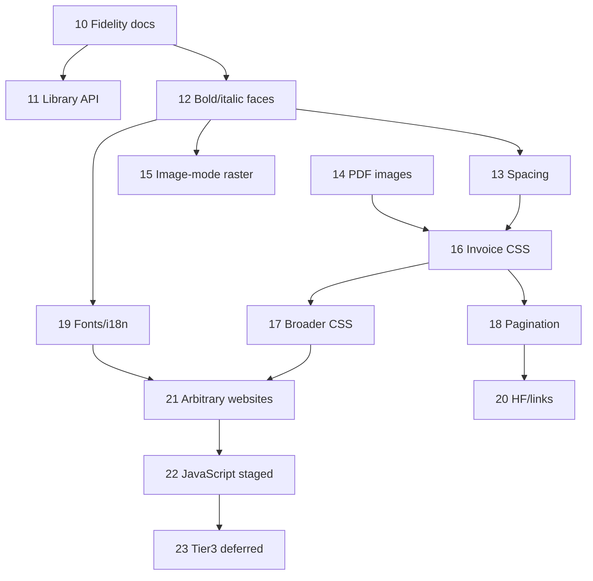

# 10 - Post-MVP Quality & Capability Roadmap (Canonical Execution Ledger)

> **Parent:** `plans/00-canonical-pure-go-rewrite.md` (MVP phases 0–9 complete, v0.1.0)  
> **Status:** active - Tier 1 partially landed (12, 13, 15 complete; 10/11/14/16 partial) as of 2026-08-04  

> **Estimated effort:** Tier 1 ~4–8 mo · Tier 2 ~6–12 mo additional · Tier 3 deferred (not planned as pure-stdlib goal)  
> **Constraint:** pure Golang, **Go standard library only** by default (no Chrome/WebKit, no cgo, no plugins).  
> **Narrow exception:** OpenType shaping may use **`github.com/go-text/typesetting` only** — see [`plans/amendments/2026-08-05-gotext-typesetting.md`](amendments/2026-08-05-gotext-typesetting.md). No other third-party modules without a new amendment.  
> **Ordering principle:** **quick wins first** (docs/API polish → typography → image mode → invoice CSS → broader CSS → fonts/i18n → web heuristics → JS research). Dependency edges still respected within each phase.  
> **Workflow:** [`skills/phase-wise-checklist/SKILLS.md`](../skills/phase-wise-checklist/SKILLS.md)

---

## Overview

MVP ships a usable **report/invoice** pipeline (load → HTML/CSS subset → layout → paginate → PDF/PNG). This ledger is the **live execution map** for post-MVP work that makes gowkhtmltopdf:

1. **Honest** about what it supports (fidelity docs + matrix)
2. **Easy to embed** from other Go apps (library API)
3. **Visually solid** for controlled reports (real bold/italic, spacing, image-mode quality, invoice CSS)
4. **Broader** for “most of my jobs” (flex/float lite, multi-font/Unicode, pagination polish)
5. **Careful** about open-web / JS ambitions under stdlib-only (staged, evidence-gated, Tier 3 deferred)

**Product tiers (from product framing):**

| Tier | Goal | This ledger |
|------|------|-------------|
| **Tier 1** | Solid report engine - “better for our use” | Phases 10–16 (must) |
| **Tier 2** | Leave wkhtmltopdf for most jobs | Phases 17–20 |
| **Tier 3** | Compete on the open web | Phase 23 - **deferred**; Chrome/Playwright territory |

**Hard non-goals unless this ledger is amended:**

- Full WebKit/Chrome pixel parity under pure stdlib
- Shipping third-party PDF/HTML engines or browser embeds
- Claiming Wikipedia parity before matrix + fixtures prove it

---


## Recommended next work (2026-08-04 reconcile)

Tier 1 is **not closed** yet. Suggested order for the next sessions:

1. **Phase 16** (complete): `float` lite, real `inline-block`, `box-sizing: border-box`.
2. **Phase 14** (complete): document JPEG/PNG alpha/DPI knobs; `web.images=false` test.
3. **Phase 11** (complete): publish/install story + `ConvertHTML` helper.

**Tier 1 is closed** (report engine solid). **Tier 2 phases 17–20 core shipped** on `master` (#16 / #17); shared matrix/fidelity honesty pass is under [`phases/subplans-tier-2/00-shared-doc-honesty.md`](phases/subplans-tier-2/00-shared-doc-honesty.md). Remaining code leftovers are tracked under [`phases/subplans-tier-2/`](phases/subplans-tier-2/). **Phase 21** is **in progress (docs contract)** — §21.1 product bar + §21.7 docs honesty landed; vendored fixtures / heuristics / acceptance owned in parallel ([detail](phases/phase-21-arbitrary-websites.md)).

**Already shipped post-MVP:** phases **10** (fidelity docs), **12** (real bold/italic faces), **13** (spacing/coalesce), **15** (image-mode TTF AA), **16** (selectors + float lite), **17–20** core (flex/grid lite, thead repeat, fonts/CJK/Arabic joining, HF/links edges).


## Executive Summary

| Fact (current evidence) | Location |
|-------------------------|----------|
| MVP phases 0–9 complete | `plans/00-canonical-pure-go-rewrite.md` |
| Liberation Sans R/B/I/BI embedded | `internal/pdf/assets/` + `faces.go` |
| Real bold/italic via `FaceSet.Resolve` (fake bold only if face missing) | `layout.faceFor`, `paint.go` |
| Image mode = pure-Go TTF outline AA (+ 2× supersample) | `internal/imageout/ttfraster.go` |
| Selectors: attr / nth-child / siblings shipped; float lite shipped | matrix §4 / §2.2 |
| Flex/grid/position = **Partial** (flex subset, grid lite, relative/absolute/fixed; sticky ≈ relative) | matrix §2.2 / feature checklist |
| thead repeat + zoom/smart-shrink re-layout shipped; orphans = heuristics | matrix Pagination / §2.6 |
| Type0/CJK + font-path; Arabic joining; local `@font-face` PDF Partial | matrix §4 / §5; fonts.md |
| JS stripped; flags warn only | load + CLI |
| Library API exists (`Converter`, examples, integration docs) | `api.go`, `examples/`, `library-api.md` |
| Wikipedia smoke PDF exists, layout poor | `output/wiki-ana-de-armas.pdf` |
| Zero module deps | `go.mod` |

**Quick-win dependency order:**

```
10 Docs/matrix honesty
  → 11 Library API polish (embedder DX)
  → 12 Real bold/italic faces
  → 13 Typography spacing
  → 14 PDF images robust path
  → 15 Image-mode TTF/AA raster
  → 16 Invoice CSS (selectors + float lite)
  → 17 Partial flex / position
  → 18 Pagination polish (thead repeat)
  → 19 Fonts/i18n discovery + CJK path
  → 20 HF / links edge cases
  → 21 Arbitrary websites / “paste any URL”
  → 22 JavaScript (staged; full engine gated)
  → 23 Tier 3 open-web (explicitly deferred)
```

---

## Phase Index

| Phase | Title | Tier | Detail ledger | Effort (solo) | Status |
|------:|-------|------|---------------|---------------|--------|
| 10 | HTML/CSS fidelity documentation | 1 | [phases/phase-10-fidelity-docs.md](phases/phase-10-fidelity-docs.md) | 3–7 days | `[x]` 2026-08-04 |
| 11 | Library API for Go embedders | 1 | [phases/phase-11-library-api-embedders.md](phases/phase-11-library-api-embedders.md) | 1–2 wk | `[x]` 2026-08-04 |
| 12 | Typography - real bold/italic faces | 1 | [phases/phase-12-typography-faces.md](phases/phase-12-typography-faces.md) | 2–4 wk | `[x]` 2026-08-04 |
| 13 | Typography - spacing stability | 1 | [phases/phase-13-typography-spacing.md](phases/phase-13-typography-spacing.md) | 1–2 wk | `[x]` 2026-08-04 |
| 14 | Images in PDF - robust path | 1 | [phases/phase-14-pdf-images.md](phases/phase-14-pdf-images.md) | 1–2 wk | `[x]` 2026-08-04 |
| 15 | Image mode - real TTF/AA raster | 1 | [phases/phase-15-image-mode-raster.md](phases/phase-15-image-mode-raster.md) | 3–6 wk | `[x]` 2026-08-04 |
| 16 | CSS invoices use (selectors + float lite) | 1 | [phases/phase-16-invoice-css.md](phases/phase-16-invoice-css.md) | 3–6 wk | `[x]` 2026-08-04 |
| 17 | Broader CSS (position/float, partial flex, grid lite) | 2 | [phases/phase-17-broader-css.md](phases/phase-17-broader-css.md) · [subplan](phases/subplans-tier-2/phase-17-pending.md) | 2–4 mo | `[x]` #16/#17; matrix honesty via shared pass |
| 18 | Pagination polish (thead repeat, breaks) | 2 | [phases/phase-18-pagination-polish.md](phases/phase-18-pagination-polish.md) · [subplan](phases/subplans-tier-2/phase-18-pending.md) | 3–6 wk | `[x]` #16; matrix/CLI docs via shared pass |
| 19 | Fonts / i18n (discovery, CJK/Type0, stdlib shaping) | 2 | [phases/phase-19-fonts-i18n.md](phases/phase-19-fonts-i18n.md) · [subplan](phases/subplans-tier-2/phase-19-pending.md) | 1–3 mo | `[x]` #16/#17; @font-face audit pending |
| 20 | HF / links edge cases | 2 | [phases/phase-20-hf-links-edges.md](phases/phase-20-hf-links-edges.md) · [subplan](phases/subplans-tier-2/phase-20-pending.md) | 2–4 wk | `[x]` #16/#17 + HF fragment GoTo |
| 21 | Arbitrary websites / paste-any-URL | 2→3 | [phases/phase-21-arbitrary-websites.md](phases/phase-21-arbitrary-websites.md) | 2–4 mo | `[~]` in progress (docs contract: §21.1 + §21.7) |
| 22 | JavaScript support (staged) | 2→3 | [phases/phase-22-javascript.md](phases/phase-22-javascript.md) | research + years for full | `[ ]` |
| 23 | Tier 3 open-web competition | 3 | [phases/phase-23-tier3-deferred.md](phases/phase-23-tier3-deferred.md) | n/a | `[~]` deferred |

---

## Goal → Phase Map

| User goal | Primary phase(s) |
|-----------|------------------|
| HTML/CSS fidelity documentation (phase-wise checklist) | **10** (+ updates in 12–17, 21) |
| Full JavaScript support | **22** (honest stages; full engine not free under stdlib) |
| Fonts / localization / installed + folder fonts | **12**, **19** |
| API library for other Go projects | **11** (MVP API exists in phase 8) |
| Arbitrary websites (Wikipedia, marketing) | **21** (+ **17**, **19**) |
| “Paste any URL and get a decent print” | **21** |
| Flex / grid / floats / position | **16** (float lite), **17** (partial flex/position); grid `[~]` |
| JS-driven pages | **22** |
| Bold/italic families + CJK | **12** (bold/italic), **19** (CJK/Unicode) |
| Image mode like a real screenshot (not 5×7) | **15** |
| Years of edge-case print CSS | **16–18**, **20**; remainder in **23** |
| Tier 1 solid report engine | **10–16** |
| Tier 2 leave wkhtmltopdf for most jobs | **17–20** |
| Tier 3 compete on open web | **23** deferred |

---

## Phase 10: HTML/CSS Fidelity Documentation

> Detail: [phases/phase-10-fidelity-docs.md](phases/phase-10-fidelity-docs.md)  
> **Why first:** pure documentation; unblocks honest product messaging and every later matrix update.  
> **Status:** complete 2026-08-04 (`documentation/fidelity.md`)

### 10.1 Fidelity contract
- [x] Publish a **fidelity guide** that states: report HTML first; not a browser
- [x] Cross-link matrix ↔ fixtures ↔ sample PDFs with pass/fail/partial
- [x] Document Tier 1 / 2 / 3 expectations and this roadmap

### 10.2 Matrix honesty pass
- [x] Re-audit every “Implemented / Partial / Not implemented” row against current code
- [x] Mark image-mode text quality limits explicitly (TTF AA shipped; residual no FreeType hinting)
- [x] Mark font-face / bold / italic / CJK limits explicitly

### 10.3 Closure
- [x] No code change required; skip `make lint`/`make test` for pure docs (skill rule)
- [x] Point README “Deferred” table at this ledger

---

## Phase 11: Library API for Go Embedders

> Detail: [phases/phase-11-library-api-embedders.md](phases/phase-11-library-api-embedders.md)  
> **Baseline:** Phase 8 complete (`api.go`, `examples/pdf`, `examples/image`, `documentation/library-api.md`)  
> **Status:** complete 2026-08-04

### 11.1 Embedder DX
- [x] Expand library docs: invoice-from-bytes, multi-object, image convert, ACL pair
- [x] Add copy-paste integration examples (HTTP handler pattern, no Gin dep in module)
- [x] Document thread-safety, deterministic output, error types

### 11.2 API surface polish
- [x] Review public API for missing helpers (`ConvertHTML` shipped)
- [x] Ensure examples build in CI / documented `go run`
- [x] Optional: `go doc` completeness on exported types
- [x] Module install / replace story in library-api.md

### 11.3 Closure
- [x] `make test` + `make lint` green; examples verified

---

## Phase 12: Typography - Real Bold (and Italic)

> Detail: [phases/phase-12-typography-faces.md](phases/phase-12-typography-faces.md)  
> **Tier 1 #1** · Related issues: multi-font, font-spacing

### 12.1 Faces
- [x] Bundle OFL Liberation Sans **Bold** (+ Italic / BoldItalic if available under same license)
- [x] Font registry: map `font-weight` / `font-style` → face
- [x] PDF: multiple subset fonts (`F0`/`F1`/…); drop fake-bold when real bold selected

### 12.2 Layout/paint
- [x] Measure with the selected face metrics
- [x] `<b>`, `<strong>`, `font-weight:bold` use bold face end-to-end
- [x] `<i>`, `<em>`, `font-style:italic` use italic face when present

### 12.3 Closure
- [x] Fixture visual smoke + tests; matrix + docs updated

---

## Phase 13: Typography - Spacing Stability

> Detail: [phases/phase-13-typography-spacing.md](phases/phase-13-typography-spacing.md)  
> **Tier 1 #1 (spacing)** · Related: issue font-spacing · **Status:** complete 2026-08-04

### 13.1 Advances
- [x] Align layout advances with PDF paint advances
- [x] Reduce word-by-word `Tj` fragmentation where safe (`coalesceTextItems`)
- [x] Regression tests for fixture-01 / fixture-16 spacing

### 13.2 Closure
- [x] No return of double letter-spacing (1000-unit `/Widths` still correct)

---

## Phase 14: Images in PDF - Robust Path

> Detail: [phases/phase-14-pdf-images.md](phases/phase-14-pdf-images.md)  
> **Tier 1 #4** · **Status:** complete 2026-08-04

### 14.1 Robustness
- [x] Harden PNG/JPEG embed path for logos and grids (fixtures 07, 20)
- [x] Broken-image / missing-src behavior documented + tested (skip without crash)
- [x] Intrinsic size / CSS width/height interactions covered (tests exist; docs polish remain)

### 14.2 Closure
- [x] Golden/structure tests; matrix image notes current (`web.images`, JPEG/PNG alpha/DPI knobs)

---

## Phase 15: Image Mode - Real Raster (Not 5×7)

> Detail: [phases/phase-15-image-mode-raster.md](phases/phase-15-image-mode-raster.md)  
> **Tier 1 #2** · Related: issue image-mode-raster-quality · **Status:** complete 2026-08-04

### 15.1 Raster path
- [x] Replace 5×7 text drawing with pure-Go TTF outline raster (or greyscale AA bitmap of same face)
- [x] Image paint advances **match** layout advances for same face/size
- [x] Anti-aliased edges; more than ~6 unique colors on body text samples

### 15.2 Closure
- [x] `make samples` PNG quality gate; docs state strategy

---

## Phase 16: CSS Invoices Actually Use

> Detail: [phases/phase-16-invoice-css.md](phases/phase-16-invoice-css.md)  
> **Tier 1 #3** · Selectors + float lite before full flex · **Status:** complete 2026-08-04

### 16.1 Selectors
- [x] Attribute selectors subset; `:first-child` / `:last-child` / simple `:nth-child`
- [x] Sibling combinators match correctly (not as descendant)

### 16.2 Layout additions
- [x] `float: left|right` + `clear` lite (enough for two-column invoice chrome)
- [x] `display: inline-block` real layout (not degrade-to-block only)
- [x] Optional: simple `box-sizing: border-box`

### 16.3 Closure
- [x] New fixtures; matrix updated; still stdlib-only

---

## Phase 17: Broader CSS (Position / Float Full / Partial Flex / Grid Lite)

> Detail: [phases/phase-17-broader-css.md](phases/phase-17-broader-css.md)  
> **Tier 2 #6** · **Status:** core shipped on `master` (#16 / #17)

### 17.1 Position & float
- [x] `position: relative` offsets; float packing refinements (`%` widths, right packing)
- [x] `position: absolute` lite (left/top/right/bottom subset)
- [x] Lite `z-index` paint sort; `position: fixed` lite
- [ ] `[~]` sticky still deferred

### 17.2 Partial flex + grid lite
- [x] `display: flex` row/column + justify/align/gap/grow/shrink/basis/order/wrap
- [x] Grid lite: column tracks, `grid-column` spans, nested grids (`fixture-28`)
- [x] Matrix/fidelity honesty (shared doc-honesty pass)

### 17.3 Closure
- [x] Fixtures 25–26–28 + layout tests; Wikipedia still not claimed

---

## Phase 18: Pagination Polish

> Detail: [phases/phase-18-pagination-polish.md](phases/phase-18-pagination-polish.md)  
> **Tier 2 #8** · **Status:** core shipped on `master` (#16)

### 18.1 Tables & breaks
- [x] Repeat table header (`thead`) on continued pages
- [x] Smarter orphan/widow + keep-heading-with-next heuristics
- [x] Wire `--zoom` through convert (+ smart-shrinking re-layout)

### 18.2 Closure
- [x] Multi-page table fixture-23 proves header repeat
- [x] Matrix/fidelity/CLI honesty for thead/zoom/orphans (shared doc-honesty pass)

---

## Phase 19: Fonts / i18n / Discovery / CJK

> Detail: [phases/phase-19-fonts-i18n.md](phases/phase-19-fonts-i18n.md)  
> **Tier 2 #7** · Localization + installed/folder fonts · **Status:** core + amendment on `master` (#16 / #17)

### 19.1 Discovery
- [x] Font search paths: bundled → `--font-path` → optional `--use-system-fonts`
- [x] Map CSS `font-family` lists to discovered faces (per-rune fallback)
- [~] `@font-face` local `src` (CSS parse shipped; end-to-end / matrix honesty pending)

### 19.2 Unicode / shaping
- [x] Type0/CID path for BMP Unicode (CJK with a capable face)
- [x] Arabic presentation-form joining + Hangul face path (no HarfBuzz)
- [x] Vertical-rl lite (90° CJK); subset glyf align + hint strip (#17)
- [x] Document shaping limits in `documentation/fonts.md`

### 19.3 Closure
- [x] CJK fixture-27; Type0 tests; `testdata/fonts` OFL Hangul subset

---

## Phase 20: HF / Links Edge Cases

> Detail: [phases/phase-20-hf-links-edges.md](phases/phase-20-hf-links-edges.md)  
> **Tier 2 #9** · **Status:** core shipped on `master` (#16)

### 20.1 Gaps from README deferred list
- [x] Inline `#anchor` link source rects where paint boxes exist
- [x] `resolveRelativeLinks` (`--resolve-relative-links` / `--keep-relative-links`)
- [x] HTML HF links on body pages (external URI + fragment GoTo shipped)
- [x] `[topage]` with copies; dump-outline TOC offset

### 20.2 Closure
- [x] Fixture-24 internal anchors + HF/link regression tests

---

## Phase 21: Arbitrary Websites / “Paste Any URL”

> Detail: [phases/phase-21-arbitrary-websites.md](phases/phase-21-arbitrary-websites.md)  
> Open-web gap work: [phases/pending-phase-items/README.md](phases/pending-phase-items/README.md)  
> **CSS-faithful cleanup:** [phases/pending-phase-items/12-css-faithful-engine.md](phases/pending-phase-items/12-css-faithful-engine.md)  
> **Status:** in progress (docs contract) — **Not full parity**; “decent print” bar  
> Normative criteria: [documentation/fidelity.md](../documentation/fidelity.md#arbitrary-websites-phase-21)

### 21.1 Product bar
- [x] Define “decent print”: title + main article body readable; chrome reduced when heuristics on — shipped in `documentation/fidelity.md` (Phase 21 section); explicit non-claims (no Wikipedia visual parity / marketing pixel match)
- [ ] Vendored Wikipedia-class HTML fixture for CI (no live net required)
- [ ] Optional reader-mode / chrome-strip heuristics (documented, opt-in)
- [ ] Site-agnostic default: remove skin-shaped cascade overrides (see pending phase 12)

### 21.2 Progressive CSS for marketing/wiki
- [ ] Consume phases 16–17 features against wiki snapshot
- [ ] Media-query basics that help print (`@media print` already partial)
- [ ] Honor author CSS/`var()` without inventing Codex/Vector token sizes

### 21.3 Closure
- [ ] Smoke command + acceptance notes; **no** “Wikipedia parity” claim
- [x] Docs honesty: matrix still not full CSS; README progressive goal only — detail plan §21.7

---

## Phase 22: JavaScript Support (Staged)

> Detail: [phases/phase-22-javascript.md](phases/phase-22-javascript.md)  
> **Constraint note:** a full ES engine is a multi-year product under pure stdlib. Stages gate ambition.

### 22.1 Honesty & architecture
- [ ] Spec: what subset of DOM/JS report templates actually need
- [ ] Keep scripts stripped by default; enable only with explicit flag

### 22.2 Incremental capability
- [ ] Stage A: keep `--javascript-delay` as post-load wait only (document)
- [ ] Stage B: optional pure-Go **expression/template** hooks if product needs (not full JS)
- [ ] Stage C: research pure-Go ES interpreter scope (stdlib-only) - spike, go/no-go
- [ ] `[~]` Stage D: full browser JS/DOM - **not planned** under stdlib; would require plan amendment (embed runtime or abandon constraint)

### 22.3 Closure for any shipped stage
- [ ] Security review (script must not escape sandbox / FS)
- [ ] Matrix + threat model updated

---

## Phase 23: Tier 3 - Compete on Open Web (Deferred)

> Detail: [phases/phase-23-tier3-deferred.md](phases/phase-23-tier3-deferred.md)

### 23.1 Explicit deferral
- [~] Real browser or large CSS/JS stack - people use Chrome headless / Playwright; pure-stdlib reimplementation is the wrong goal for open-web parity  
  **Owner boundary:** product decision only; next gate = amend constraint or accept external engine  
  **Pointer:** this row is the sole Tier-3 ledger; do not re-open in active Tier-1/2 phases without amendment

---

## Dependencies



| Rule | Note |
|------|------|
| Docs (10) first | Every later phase updates matrix when shipping features |
| Faces (12) before image raster (15) | Share font registry / metrics |
| Invoice CSS (16) before web (21) | Report CSS is the quick win; web reuses it |
| JS (22) after layout breadth | DOM without CSS/layout is useless for “JS pages” |
| Tier 3 never blocks Tier 1 | Phase 23 stays `[~]` |

---

## Explicit Non-Goals (unless amended)

| Item | Reason |
|------|--------|
| Full WebKit parity under stdlib | Unbounded; Tier 3 |
| Third-party modules / cgo FreeType / browser embed | Project constraint |
| Network webfonts without ACL policy | Security |
| Arabic/Indic full shaping | Needs HarfBuzz-class stack |
| PDF encryption / PDF/A | Out of original scope |
| Claiming “screenshot parity” for image mode | Aim for “looks like a real print raster”, not Chrome |

---

## Completion Handoff Rules

Per [`skills/phase-wise-checklist/SKILLS.md`](../skills/phase-wise-checklist/SKILLS.md):

1. Mark a row `[x]` only after source/test evidence for that row.
2. Non-doc changes: record `make lint` + `make test` outcomes on phase closure.
3. Use `[~]` with reason + next gate for partials/deferrals.
4. Do not leave the same active work in two ledgers; point old rows here if superseded.
5. After each phase: brief result + next unchecked phase.

---

## Related Artifacts

| Artifact | Role |
|----------|------|
| `documentation/compatibility-matrix.md` | Support contract |
| `plans/PR/issues/issue-epic-rendering-quality-body.md` | GitHub epic #2 archive |
| `plans/PR/issues/issue-*-body.md` | Child issue archives |
| `output/` | Visual smoke PDFs/PNGs |
| `testdata/golden/` | Report fixtures |
| `README.md` Deferred table | Must stay synced with this ledger |
