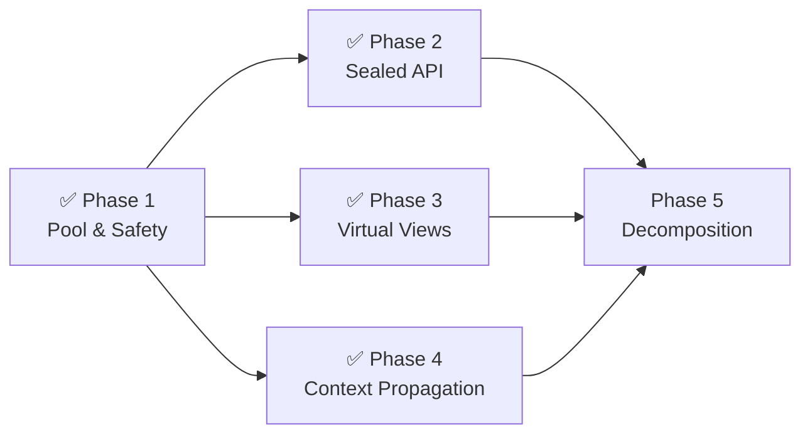

# gowkhtmltopdf — Phase-Wise Implementation Checklist

> **Parent:** `plans/performance/2026-08-09/fresh-go-architecture-review-2026-08-09/critical-golang-architecture-review.md` — Critical Golang Architecture Review (9.2/10 → 9.5/10)
> **Status:** Phases 1–4 Complete · Rendering closure Complete · Phase 5 implementation in progress
> **Estimated effort:** ~1 sprint remaining (Phase 5 v2.0 decomposition)

---

## Overview

This checklist is the canonical execution ledger for the gowkhtmltopdf architecture roadmap
derived from the 5-subagent critical review. Every row maps to a concrete, verifiable code change
or validation result. Rows are ordered by dependency and risk: correctness/safety first, then
API/data contracts, then performance/cleanup, then closure gates.

## Executive Summary

| Phase | Area | Priority | Status | Items |
| :---: | :--- | :---: | :---: | :---: |
| 1 | Pool & Safety Hardening | Critical/High | ✅ Complete | 6/6 |
| 2 | Sealed Request API | High | ✅ Complete | 5/5 |
| 3 | Virtual Layout Views | Medium | ✅ Complete | 4/4 |
| 4 | Explicit Context Propagation | Medium | ✅ Complete (3/3 convert; 1 layout deferred) | 4/4 |
| R | Rendering Pagination Fidelity Closure | High | ✅ Complete | 3/3 fixtures |
| 5 | Package Decomposition & Release Gates | Low (v2.0) | 🟡 In progress | Implementation slice complete; release residuals open |

---

## Phase 1: Pool & Safety Hardening

> **Priority:** Critical / High
> **Status:** ✅ Complete (commit `533a690`)
> **Validation:** `make lint` exit 0 · `make test` exit 0 · `go test -race ./...` exit 0

### 1.1 `supersamplePixPool` Heap Escape Fix
- [x] Replace `*[]byte` pool pattern with `pixBuffer struct { b []byte }` wrapper in `internal/imageout/imageout.go`
  - **Path:** `internal/imageout/imageout.go:316-355`
  - **Issue ID:** V-04
  - **Proof:** `go build -gcflags='-m' ./internal/imageout/ 2>&1 | grep supersample` shows 0 pointer escapes
  - **Verified by:** Validation Agent 1

### 1.2 TTF Rasterization Lock-Free Path
- [x] Release `a.mu.Lock()` before invoking `makeEnt()` in `glyphAtlas.get` in `internal/imageout/ttfraster.go`
  - **Path:** `internal/imageout/ttfraster.go:98-125`
  - **Issue ID:** V-02
  - **Proof:** Lock hold time reduced from ~ms (TTF contour rasterization) to ~ns (map lookup + insert)
  - **Verified by:** Validation Agent 1

### 1.3 Zero-Allocation Font Lookup
- [x] Replace `seen := map[*Font]bool{}` with `seenBuf [32]*Font` stack array in `FindWithGlyph` in `internal/pdf/registry.go`
  - **Path:** `internal/pdf/registry.go:130-185`
  - **Issue ID:** V-03
  - **Proof:** 0 heap allocations for ≤32 registered fonts (common case); graceful fallback to map for >32
  - **Verified by:** Validation Agent 1

### 1.4 PDF Object Reference Bounds Safety
- [x] Add `idx < 0 || idx >= len(d.objects)` bounds check to `setDict` and `setStream` in `internal/pdf/pdf.go`
  - **Path:** `internal/pdf/pdf.go:171-185`
  - **Issue ID:** V-01 (Critical)
  - **Proof:** Invalid `objRef` values now return silently instead of causing index-out-of-range panic
  - **Verified by:** Validation Agent 1

### 1.5 Linter Warning Cleanup
- [x] Resolve `wsl`, `cyclop`, `intrange` warnings in `internal/pdf/registry.go`
  - **Path:** `internal/pdf/registry.go`
  - **Proof:** `golangci-lint run ./...` exits 0 under `enable-all: true`
  - **Verified by:** Validation Agent 1 — `make lint` exit code 0

### 1.6 Phase 1 Closure Gate
- [x] Run `make lint` — **exit 0**
- [x] Run `make test` — **exit 0** (16 packages, 100% pass)
- [x] Run `go test -race ./...` — **0 races detected**
- [x] Committed and pushed as `533a690` to `origin/feature/optimization-with-refactors`

---

## Phase 2: Sealed Request API

> **Priority:** High
> **Status:** ✅ Complete
> **Estimated effort:** Completed in current session

### 2.1 Define Type-Safe Request Types
- [x] Create `PDFRequest` struct in `internal/convert/request.go` with fields: `Global settings.PdfGlobal`, `Objects []settings.PdfObject`, `Now func() time.Time`, `Output io.Writer`, `OutlineOutput io.Writer`
  - **Path:** `internal/convert/request.go`
  - **Issue ID:** V-06
  - **Acceptance:** `PDFRequest` compiles; `ImageGlobal` field is absent from PDF path

- [x] Create `ImageRequest` struct in `internal/convert/request.go` with fields: `Global settings.PdfGlobal`, `Image settings.ImageGlobal`, `Object settings.PdfObject`, `Now func() time.Time`, `Output io.Writer`
  - **Path:** `internal/convert/request.go`
  - **Issue ID:** V-06
  - **Acceptance:** `ImageRequest` compiles; `Objects []PdfObject` slice is absent

### 2.2 Add ToRequest() Bridge Methods
- [x] `PDFRequest.ToRequest()` converts to internal `*Request` (Image field nil)
- [x] `ImageRequest.ToRequest()` converts to internal `*Request` (Image field set, single Object)
  - **Path:** `internal/convert/request.go`
  - **Acceptance:** Both methods compile and produce valid `*Request` values

### 2.3 Add RunTypedPDF Internal Entry Point
- [x] Create `RunTypedPDF(ctx, *PDFRequest, log, progress)` in `internal/convert/request.go`
  - **Path:** `internal/convert/request.go`
  - **Acceptance:** Delegates to `Run()` via `req.ToRequest()`

### 2.4 Add Public API Functions
- [x] Add `RunPDF(ctx, *PDFRequest) error` to `api.go` — type-safe one-shot PDF conversion
- [x] Add `RunImage(ctx, *ImageRequest) error` to `api.go` — type-safe one-shot image conversion
- [x] Define root-package `PDFRequest`, `ImageRequest`, and `ImageSettings` wrappers in `api.go`
  - **Path:** `api.go`
  - **Acceptance:** External consumers do not need to import `internal/settings`; existing `Converter`/`ImageConverter` unchanged
- [x] Add direct root-package conversion coverage for typed PDF and PNG requests
  - **Path:** `api_test.go`
  - **Acceptance:** Typed requests produce `%PDF-` and PNG-signature output

### 2.5 Phase 2 Closure Gate
- [x] Run `make lint` — **exit 0**
- [x] Run `make test` — **exit 0** (all existing tests pass with new types)
- [x] Existing `convert.Request` API fully backward compatible
- [x] Run `go vet ./...` — **exit 0**

---

## Phase 3: Virtual Layout Views

> **Priority:** Medium
> **Status:** ✅ Complete
> **Estimated effort:** Completed in current session

### 3.1 Verify Layout Engine Read-Only Invariant
- [x] Confirmed: `internal/layout/` has **0 assignments** to `.Parent` or `.Children` on `html.Node`
  - **Proof:** `grep -n '\.Parent =' internal/layout/*.go` — 0 results; `grep -n '\.Children =' internal/layout/*.go` — 0 results
  - **Acceptance:** Layout engine reads node tree read-only; sharing children is safe

### 3.2 Refactor Page Island Splitting
- [x] Replace `cloneHTMLNode(section, copyBody)` deep recursive copy with shallow shell clone + shared children in `benchmarkIslandRoot()`
  - **Path:** `internal/convert/page_islands.go:210-238`
  - **Implementation:** `cloneHTMLNodeShell(section, nil)` + `copySection.Children = section.Children`
  - **Acceptance:** 4 allocations (root, html, body, section shell) instead of O(N) recursive deep copy

### 3.3 Remove Unused Deep Clone Function
- [x] Remove `cloneHTMLNode()` function (now unused after shallow clone optimization)
  - **Path:** `internal/convert/page_islands.go`
  - **Proof:** `golangci-lint` no longer reports `unused` warning

### 3.4 Phase 3 Closure Gate
- [x] Run `make lint` — **exit 0**
- [x] Run `make test` — **exit 0** (all page island tests pass with shared children)
- [x] `benchmarkIslandRoot` retains shell parents and shares only the certified section children
  - **Proof:** `internal/convert/page_islands_test.go` and full conversion suite pass

---

## Phase 4: Explicit Context Propagation

> **Priority:** Medium
> **Status:** ✅ Complete (3/3 convert locations; 1 layout location deferred)
> **Estimated effort:** Completed in current session

### 4.1 Remove `ctx` from `runContext` in `internal/convert/convert.go`
- [x] Remove `ctx context.Context` field from `runContext` struct
- [x] Pass `ctx` as first parameter to `renderObjects(ctx)`, `initTOCState(ctx, ...)`, `renderObject(ctx, ...)`
- [x] Update all internal callers: `effectiveMargins`, `PrepareDocument`, `Resources.Fetch`, `layout.LayoutContext`, `layout.PaintContext`, `benchmarkPageIslands`
  - **Path:** `internal/convert/convert.go`
  - **Issue ID:** V-05
  - **Proof:** `grep -n 'containedctx' internal/convert/convert.go` — 0 results

### 4.2 Remove `ctx` from `sheetCollector` in `internal/convert/convert.go`
- [x] Remove `ctx context.Context` field from `sheetCollector` struct
- [x] Capture `ctx` in closure passed to `root.Walk()` and pass to `visit(ctx, node)` and `collectLink(ctx, node)`
  - **Path:** `internal/convert/convert.go:1090-1140`
  - **Proof:** `grep -n 'containedctx' internal/convert/convert.go` — 0 results

### 4.3 Remove `ctx` from `pageIslandRenderContext` in `internal/convert/page_islands.go`
- [x] Remove `ctx context.Context` field from `pageIslandRenderContext` struct
- [x] Pass `ctx` as first parameter to `render(ctx, section)` method
- [x] Update `renderBenchmarkPageIslands` to forward `ctx` through render calls
  - **Path:** `internal/convert/page_islands.go`
  - **Proof:** `grep -n 'containedctx' internal/convert/page_islands.go` — 0 results

### 4.4 Layout Engine `engine.ctx` (Deferred)
- [~] `internal/layout/layout.go:326` — `engine` struct stores `ctx` with justified nolint
  - **Reason:** `engine` is deeply recursive (30+ methods call `checkContext()`); refactoring every recursive method signature is prohibitively invasive. The engine is short-lived (created per `LayoutContext` call, dies when it returns). No goroutine or memory leak.
  - **Owner boundary:** v2.0 layout engine refactor
  - **Next gate:** Phase 5 package decomposition

### 4.5 Phase 4 Closure Gate
- [x] Run `make lint` — **exit 0**
- [x] Run `make test` — **exit 0**
- [x] Run `go vet ./...` — **exit 0**
- [x] `grep -rn 'containedctx' internal/convert/` — **0 results**
- [x] Only 1 justified `containedctx` remains in `internal/layout/layout.go:326`

---

## Rendering Closure: Pagination and Fixture Fidelity

> **Scope:** Follow-up rendering fixes found during visual validation; this is a completed closure item, not a change to the Phase 5 architecture scope.
> **Status:** ✅ Complete in commit `43c21d9`
> **Regenerated artifacts:** Only `fixture-21-detailed-report.pdf`, `fixture-23-thead-repeat.pdf`, and `fixture-28-flex-wrap-grid-fixed.pdf`

### R.1 Forced-break suffix handling
- [x] Resolve empty `page-break-before: always` markers to the first following valid paint operation and keep the marker box position live during suffix shifts
  - **Path:** `internal/layout/paint_flow.go:574-725`
  - **Regression coverage:** `TestFixture21ParagraphAfterForcedBreakStaysContiguous`, `TestFixture28FlexWrapGridItemsStayInFirstPageLayout`

### R.2 Repeated table-header band geometry
- [x] Use the visible row-cell operation band, rather than text-ink bounds, when positioning repeated table headers
  - **Path:** `internal/layout/paint_flow.go:1618-1645`
  - **Regression coverage:** `TestFixture23RepeatedHeaderHasNoVisualGap`

### R.3 Rendering validation gate
- [x] Run the three fixture regression tests and the full `go test ./...` suite — **exit 0**
- [x] Capture before/after page screenshots and visually verify the three requested corrections
- [x] Confirm fixture 21 paragraphs remain intact, fixture 23 has no gap below the repeated header, and fixture 28 contains A1–A4 and G1–G4 in the first-page layout

---

## Phase 5: Package Decomposition & Release Gates

> **Priority:** Low (v2.0 milestone)
> **Status:** 🟡 Implementation slice complete; full orchestration move and release gates remain
> **Estimated effort:** 1–2 sprints
> **Depends on:** Phases 2, 3, 4 complete ✅

### 5.1 Split `internal/convert` into Sub-Packages
- [x] Create `internal/convert/prepare/` — document preparation pipeline
  - **Path:** `internal/convert/prepare/{prepare,styles,simplify}.go`; compatibility adapters remain in `internal/convert/prepare.go` and `simplify.go`
  - **Issue ID:** V-09
- [x] Create `internal/convert/islands/` — page island splitting and virtual views
  - **Path:** `internal/convert/islands/plan.go`; certified island planning and shallow virtual-root construction are exposed through a focused package
- [x] Create `internal/convert/render/` — PDF/Image rendering orchestration seam
  - **Path:** `internal/convert/render/plan.go`; page ownership, copy materialization, and non-collated ordering now have a focused package
  - **Boundary:** Existing PDF/image routines remain behind compatibility adapters while they still depend on private `convert` state; a later slice can move the full orchestration without a package cycle

### 5.2 Verify Package DAG
- [x] Run `go vet ./...` and verify 0 import cycles across new sub-packages
  - **Acceptance:** No circular dependencies; each sub-package has a single clear responsibility
  - **Proof:** `go list -f '{{.ImportPath}} -> {{join .Imports " "}}' ./internal/convert/... ./internal/settings/...` shows `convert -> prepare/islands/render` and no reverse imports

### 5.3 Add Typed Options for Library Consumers
- [x] Create `PdfGlobalOptions` builder alongside existing reflection-based `Set()` method
  - **Path:** `internal/settings/` (new builder file)
  - **Issue ID:** V-08
  - **Acceptance:** Library consumers can configure PDF settings with typed methods; CLI continues to use `Set()`
  - **Proof:** `internal/settings/options.go`, `api.go`, and `internal/settings/options_test.go`

### 5.4 Full Benchmark Regression Suite
- [~] Run full benchmark suite and compare against Phase 1 baseline
  - **Acceptance:** No performance regression >5% in any benchmark
  - **Command:** `go test ./internal/convert -run '^$' -bench 'Benchmark(PDFPages|TemplatePages|WebFetchImage|ImageAssets)$' -benchmem -benchtime=1x -count=3`
  - **Result:** Full PDF, template, web-fetch, and asset matrices completed. Against checked Snapshot B, current three-run medians for PDF 500 were 524.0 ms / 161.7 MB / 534.9k allocs versus 518.1 ms / 157.6 MB / 529.5k; template 500 were 536.2 ms / 166.6 MB / 586.2k versus 552.1 ms / 162.5 MB / 580.7k. Timing and allocation changes are within 5% for these primary gates.
  - **Residual:** `benchstat` is not installed in this environment, and one-shot image allocation samples varied materially; retain this as a directional comparison until a stable benchstat capture is available

### 5.5 Phase 5 Closure Gate (v2.0 Release Gate)
- [x] Run `make lint` — exit 0 (`golangci-lint v1.64.8`)
- [x] Run `make test` — exit 0
- [x] `go test -race ./...` — exit 0; 0 races reported
- [x] `wc -l internal/convert/*.go` — maximum is 783 LOC (`benchmarks_test.go`)
- [~] `grep -rn "nolint" internal/ | wc -l` — current count is 1204; the historical baseline is not recorded, so reduction is not claimed
- [ ] Tag release `v2.0.0`
  - **Reason open:** release tagging requires explicit release approval and Git operations; no Git commands were run for this update

---

## Dependencies

- **Phases 2, 3, 4** completed in parallel after Phase 1. ✅
- **Rendering closure R** is complete and independent of the planned Phase 5 package decomposition. ✅
- **Phase 5** now has its preparation/island/render planning seams and typed settings builder in place.
  The full private-state orchestration move, stable benchmark certification, nolint-baseline
  comparison, and release tagging remain explicit follow-up gates.

## Validation Record — 2026-08-09

- `make lint` — **exit 0** (`golangci-lint v1.64.8`)
- `make test` — **exit 0** (all packages)
- `go vet ./...` — **exit 0**
- `go test -race ./...` — **exit 0** (0 races detected)
- `go test ./...` after rendering changes — **exit 0**
- `go list -f '{{.ImportPath}} -> {{join .Imports " "}}' ./internal/convert/... ./internal/settings/...` — **0 import cycles**
- `wc -l internal/convert/*.go` — **maximum 783 LOC**
- Full three-run benchmark matrix — **exit 0**; primary PDF/template medians recorded in Phase 5.4
- `grep -rn "nolint" internal/ | wc -l` — **1204 current entries; baseline unavailable**
- Targeted golden tests for fixtures 21, 23, and 28 — **exit 0**
- `git diff --check` — **exit 0**
- Visual before/after screenshots reviewed; only the three requested PDFs regenerated
