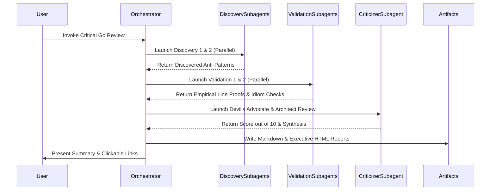

# Critical Golang Architecture Review & Multi-Agent Discovery Workflow

This skill defines the multi-agent workflow, subagent roles, discovery prompts, validation checks, and reporting standards for conducting a deep, critical Golang codebase architecture review.

---

## 1. Overview & Multi-Agent Role Division

The review process utilizes **5 specialized subagents** operating across three distinct tracks:

```
                  ┌───────────────────────────────────────────────┐
                  │           Orchestrator Agent                  │
                  └───────────────────────┬───────────────────────┘
                                          │
       ┌──────────────────────────────────┼──────────────────────────────────┐
       │ Track A: Discovery               │ Track B: Validation              │ Track C: Criticism
       ▼                                  ▼                                  ▼
┌───────────────┐  ┌───────────────┐  ┌───────────────┐  ┌───────────────┐  ┌────────────────┐
│ Discovery 1   │  │ Discovery 2   │  │ Validation 1  │  │ Validation 2  │  │ Critical       │
│ (API/Errors)  │  │ (Engine/Mem)  │  │ (Empirical)   │  │ (Go Idioms)   │  │ Architect      │
└───────────────┘  └───────────────┘  └───────────────┘  └───────────────┘  └────────────────┘
```

| Role | Subagent Name | Responsibilities | Target Areas |
| :--- | :--- | :--- | :--- |
| **Track A: Discovery 1** | API & Ergonomics Discoverer | Audit public surface, request union structs, settings reflection, error sentinels, context propagation. | `api.go`, `internal/settings`, `internal/load`, `internal/cli`, `internal/errs` |
| **Track A: Discovery 2** | Engine & Memory Discoverer | Audit mutex locking granularity, `sync.Pool` allocations, DOM tree cloning, flow index invalidations. | `internal/convert`, `internal/layout`, `internal/pdf`, `internal/imageout`, `internal/svg` |
| **Track B: Validation 1** | Empirical Validator | Verify discovered findings against actual line numbers, test suites (`make test`), race detectors (`go test -race`), and bounds checks. | Entire codebase & test fixtures |
| **Track B: Validation 2** | Go Idioms Validator | Verify findings against Go stdlib design standards (`net/http`, `io`, `image`), package decoupling (DAG), and C++ Qt port heritage. | Entire codebase |
| **Track C: Criticizer** | Lead Architect (Devil's Advocate) | Synthesize findings, evaluate production wins vs theoretical nitpicks, assign rating out of 10, detail Good vs Bad, and build 10/10 roadmap. | All findings & benchmarks |

---

## 2. Subagent Prompt Templates

### Subagent Prompt 1: Discovery Agent 1 (API & Ergonomics)
```text
Perform a critical discovery audit of API Ergonomics, Package Boundaries, Error Types, and Settings Configuration:
Files to inspect:
- api.go
- internal/settings/settings.go, pagesize.go, reflect.go
- internal/load/load.go
- internal/cli/cli.go
- internal/app/pdf.go, image.go
- internal/errs/errs.go

Identify everything that is BAD or suboptimal about how Go is used:
1. Public API ergonomics (e.g., convert.Request union vs sealed option interfaces, mutable settings structs, exported vs internal types).
2. Error handling (sentinel errors vs wrapcheck suppression, loss of error context, error message consistency).
3. Context propagation (handling nil context in internal packages, cancellation check locations).
4. CLI / Settings architecture (reflection usage in settings, package globals, flag parsing overhead).

Return structured findings with file paths, line numbers, current code, flawed pattern explanation, and ideal Go idiomatic alternative.
```

### Subagent Prompt 2: Discovery Agent 2 (Engine & Memory)
```text
Perform a critical discovery audit of the Layout Engine, PDF Rendering, Image Output, Memory Pools, and Concurrency:
Files to inspect:
- internal/convert/convert.go, hf.go, page_islands.go, prepare.go
- internal/layout/layout.go, paint.go, paint_flow.go, paint_pagination.go
- internal/pdf/pdf.go, registry.go, images.go
- internal/imageout/imageout.go
- internal/svg/raster.go

Identify everything that is BAD or suboptimal in terms of Go performance, memory allocations, and concurrency:
1. Mutex locking granularity (e.g. coarse sync.RWMutex on pdf.Document and pdf.Registry, lock contention risks).
2. Memory pool mechanics (e.g. supersamplePixPool allocation overhead, flate compressor pool copying).
3. DOM ownership & layout memory footprint (deep copying HTML nodes during page island split, slice reallocations in flow buckets).
4. Large function complexity and nolint directive overuse (nolint suppressions hiding structural complexity).

Return structured findings with file paths, line numbers, current code, flawed pattern explanation, and ideal Go idiomatic alternative.
```

### Subagent Prompt 3: Validation Agent 1 (Empirical Codebase Validator)
```text
Validate the findings of Discovery Agents 1 & 2 against empirical codebase evidence:
Files to inspect:
- all files under internal/ and root api.go
- test files (wk_compare_test.go, perf_test.go, etc.)

Verify:
1. Are the discovered lock contention issues, memory allocations, or error handling flaws real and reproducible?
2. Test code paths and bounds checks: where do potential panics, race conditions, or unhandled nil pointers still exist?
3. Benchmarks & Performance: does the current implementation actually match wkhtmltopdf performance, or are there hidden allocation spikes under multi-page heavy HTML workloads?

Return a validated report ranking each finding by severity (Critical, High, Medium, Low), confirming or refuting discovery claims with line-level proof.
```

### Subagent Prompt 4: Validation Agent 2 (Go Idioms & Architecture Validator)
```text
Validate the findings of Discovery Agents 1 & 2 against Go idioms, stdlib design standards, and architecture best practices:
Files to inspect:
- api.go
- internal/load/load.go
- internal/convert/convert.go
- internal/layout/layout.go
- internal/pdf/pdf.go

Verify:
1. API Design: Is gowkhtmltopdf following standard Go library idioms (like net/http, os, image, io)?
2. Package decoupling: Are internal packages cleanly isolated or do they have circular dependencies/leaky abstractions?
3. Idiomatic Go vs C/C++ port heritage: Where is C++ style (like manual pool pointer tricks, C-style flags, heavy struct passing) leaking into Go code?

Return a validated idiomatic Go assessment report.
```

### Subagent Prompt 5: Critical Architect & Reviewer (Devil's Advocate)
```text
Act as the Lead Golang Architect & Critical Reviewer:
Your job is to synthesize all discovery and validation findings into a brutal, honest, and highly constructive Go architectural critique.

Determine:
1. Rating out of 10: Provide an overall numerical rating out of 10 for the current codebase state.
2. What is GOOD in the current project: Detail all solid engineering choices (e.g. zero CGO dependencies, pure Go CSS/HTML parsing, high wkhtmltopdf speedup factor, test suite pass rate).
3. What is BAD in the current project: Detail all architectural debt, C++ porting artifacts, linter suppressions, lock contention, memory footprint issues, and API design flaws.
4. Critique of Findings (Devil's Advocate): Critically evaluate whether proposed refactorings are necessary production improvements or over-engineered theoretical nitpicks.
5. Actionable Roadmap to a True 10/10 Go Codebase.

Return your critique in structured markdown format ready for synthesis.
```

---

## 3. Report Output Requirements

Upon completion of the subagent review wave, the orchestrator generates **two artifact reports** stored in the destination target folder:

1. **Markdown Report (`critical-golang-architecture-review.md`)**:
   - Overall score out of 10 with weighted assessment matrix.
   - Comprehensive "What is GOOD" vs "What is BAD" analysis.
   - Detailed findings with file paths, line numbers, flawed code snippets, and 10/10 idiomatic solutions.
   - Subagent validation matrix & Devil's Advocate evaluation.
   - Actionable 5-phase 10/10 refactoring roadmap.

2. **Interactive HTML Presentation (`executive-summary-critical-review.html`)**:
   - Modern HSL dark theme with Outfit & Inter typography.
   - Header with visual score pill badge (e.g., `8.4 / 10`) and benchmark comparison metrics.
   - Interactive tabbed navigation: Executive Scorecard, Good vs Bad Breakdown, 5 Subagent Audit & Validation, Devil's Advocate Critique, 10/10 Actionable Roadmap.
   - Code diff comparison snippets (`code-bad` vs `code-good`).
   - Self-contained HTML with zero external JS framework dependencies.

---

## 4. Execution Workflow Summary


